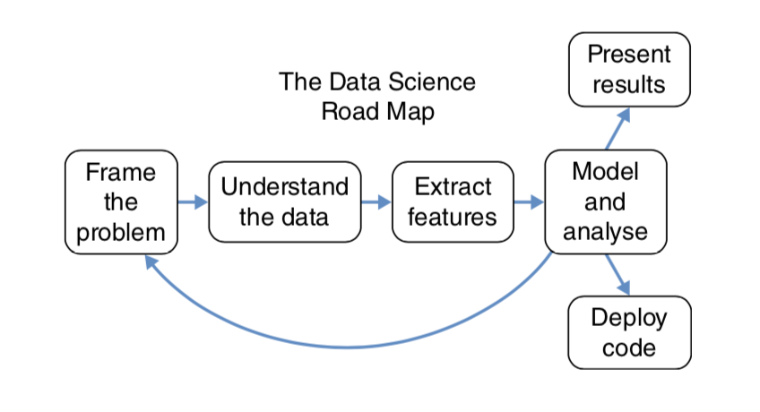

# The Data Science Road Map

__First__, frame the problem. It means to __understand the business use case__ and __craft a well-defined analytics problem out of it__. Then, **grappling with the data and the real world things that it represents**. This is followed by **extracting meaningful features**. Finally, those features are **plugged into analytical tools that yields hard numerical results**.

> Questions are always being reframed as new insights are available. Hence, there is a loop back after “Model and Analyze”.

There are two results of data science process:

1. **Presenting results** - _machine clients_
2. **Deploying code** - _human clients_

## Frame the Problem

The difference between great and mediocre data science is about __asking the right question(s)__ or __deciding what exactly the software should do__.

It’s important to clarify what would constitute a solution to the problem by creating a __”definition of done”__.

* What criteria constitute a complete project?
* what would be required to make a project a success?

This process is actually a _collaborative process involving a lot of back-and-forth with stakeholders.

It comes with many names, __statements of work (SOW)__ in consulting, or for company that is creating a product, they are often referred to as __project requirements documents (PRD)__.

The main purpose of them, especially this _framing the problem_ process, is to get everybody, mainly data scientist, on the same page about what exactly work should be done, what priorities are, and what expectations are realistic.

## Understanding the Data: Basic Questions

It’s always good to have a bunch of list of standard questions about the data. A few good generic questions are as follows:

* How big is the dataset?
* Is this the entire dataset?
* Is this data representative enough? For example, maybe data was only collected for a subset of users.
* Are there likely to be gross outliers or extraordinary sources of noise? For example, 99% of the traffic from a web server might be a single denial‐of‐service attack.
* Might there be artificial data inserted into the dataset?
* Are there any fields that are unique identifiers?
* Are the supposedly unique identifiers actually unique? What does it mean if they aren’t?
* If there are two datasets A and B that need to be joined, what does it mean if something in A doesn’t matching anything in B?
* When data entries are blank, where does that come from?
* How common are blank entries?

SOW often include an appendix that describes the available data, about what representation is the data describe.

## Understanding the Data: Data Wrangling

It’s **the process of getting the data from its raw format into something suitable for more conventional analytics**.

This process means __creating a software pipeline__ that _gets the data_ out of wherever it’s stored, _does any cleaning_ or filtering, and _puts it into a regular format_. For this process, the data doesn’t need to be in a final processed data, the work is just to get the data and make sure our chosen tools can read it and process it.

## Understand the Data: Exploratory Analysis
